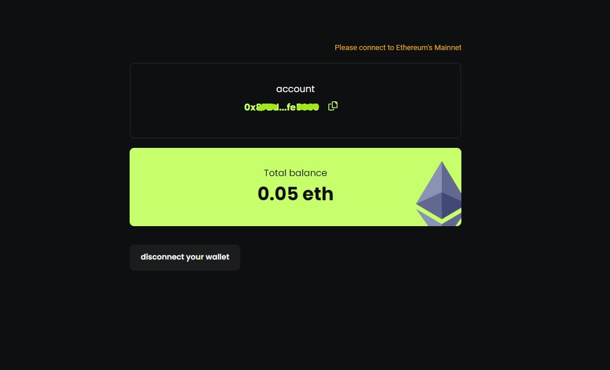

# Wallet d'app

This is a react web app that connects to your MetaMask wallet and displays your account number and balance, using the Web3.js and react-Web3 libraries.

## demo

**To try the dapp:** [**click here**](https://ahbari-m.github.io/wallet-dapp/)



## general overview of the implementation steps

- First, install the necessary dependencies by running the following command in your terminal:

```terminal
    yarn add web3 
    yarn add @web3-react/core
```

- Next, import the Web3 and react-Web3 libraries in your React component:

```js
    import Web3 from 'web3';
    import { Web3ReactProvider } from '@web3-react/core';
```

- Create a function that returns a new instance of the Web3 library, and provide it with the provider of your MetaMask wallet:

```js
    const getLibrary = (provider) => {
      return new Web3(provider);
    }
```

- Use the Web3ReactProvider component from the react-web3 library to wrap your React app, and provide it with the getLibrary function as a prop:

```js
    <Web3ReactProvider getLibrary={getLibrary} >
        {/* Your react app components here */}
        <App />
    </Web3ReactProvider>
```

- You can now access your MetaMask account information by using the useWeb3React hook provided by the react-web3 library in your React components. For example, the following code will get your account number, and display it in a `<p>` element:

```js
    import { useWeb3React } from '@web3-react/core';

    const MyComponent = () => {
      const { account } = useWeb3React();
      return (
        <p>
          Account: {account} 
        </p>
      );
    };
```

- Now to access your MetaMask account balance in your React components, we will use a state for that, and useEffect hook to update it. Here is the same example from the previous step:

```js
    import { useWeb3React } from '@web3-react/core';

    const MyComponent = () => {
      const { account, library } = useWeb3React();
      const [ balance , setBalance ] = useState();

      useEffect(()=> {
          library?.eth.getBalance(account).then((result)=>{
            setBalance(result)
          })

      }, [ account, library ])

      return (
        <p>
          Account: {account} 
          Balance: {balance}
        </p>
      );
    };
```

That's it! With these steps, you should now have a React web app that connects to your MetaMask wallet and displays your account number and balance.
